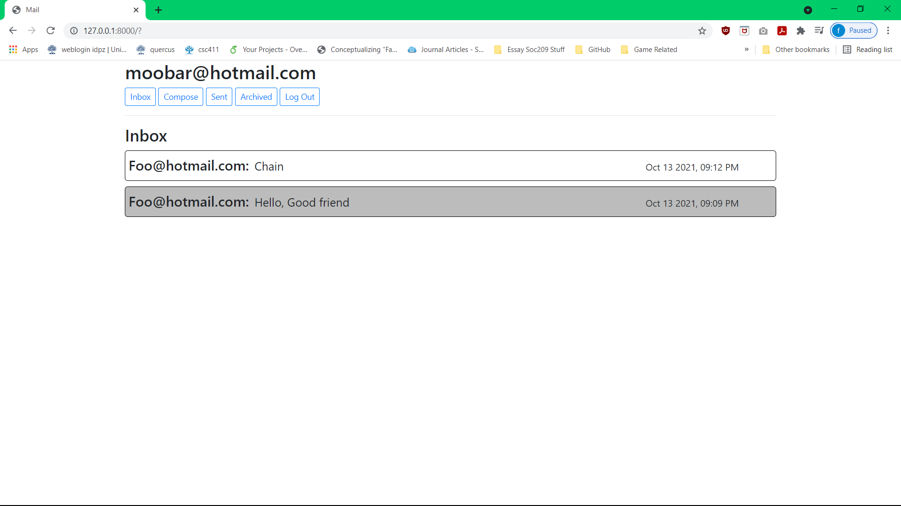
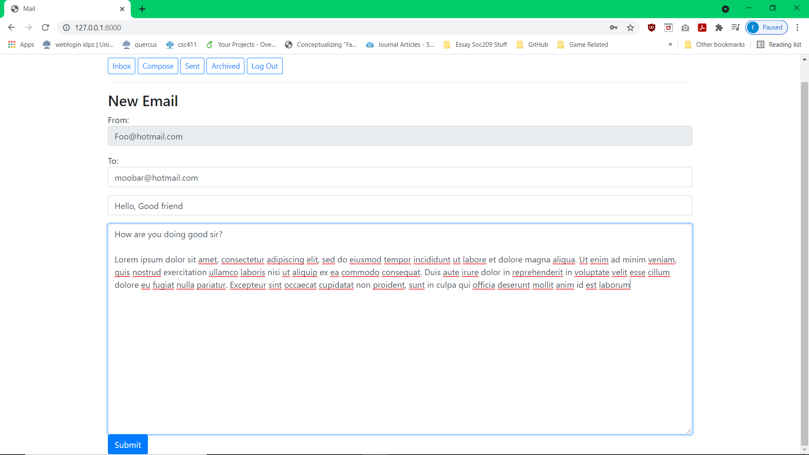
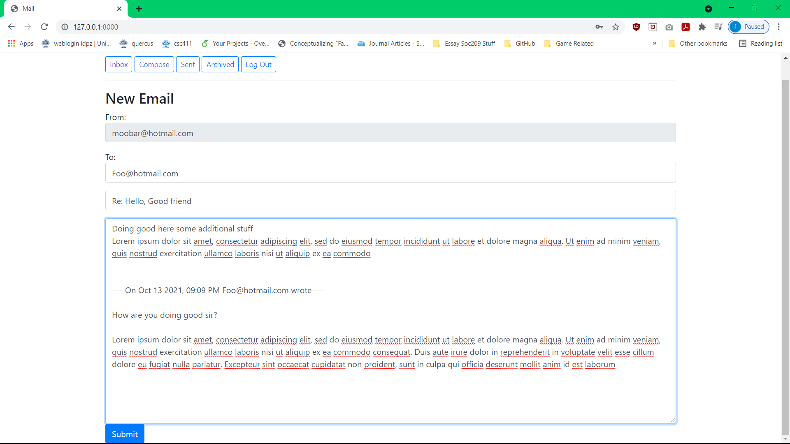
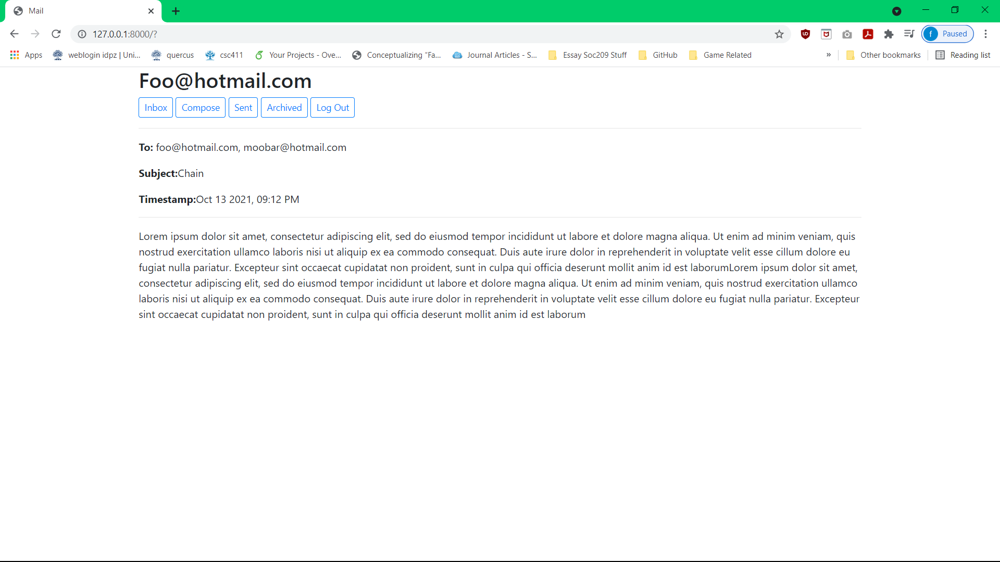
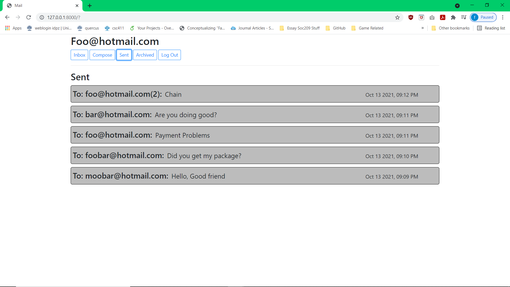
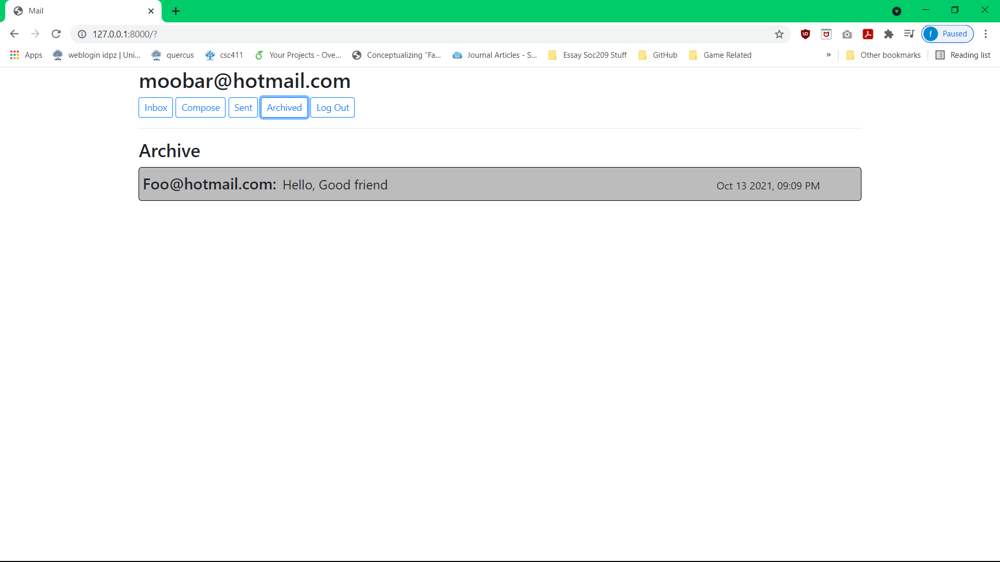

# Mail System

## Decription
It is an mailing web application where users on the platoform can send mail to one another. The users have many function that they can use such as composing, archiving, deleting, and reply to emails. There are some quality of life functionality such as appending the email you are replying to in the text field. Or being able to send the same email to multiple users at once.

### Technology
- Django Framework
- Javascript, HTML, CSS, Bootstrap
- NoSQL

I have previous experience using both Python and the Flask framework figured I would have skills that would carry over into Django. The reason behind Javascript, HTML, CSS, and 
Bootstrap is because they worked very well with Django's tempalate system.

### Struggle Faced
- Fetching previous emails that uers have sent in a email chain, and displaying in the correct order.
- Keeping a consistent visual design over the all aspects of the application.

## Screenshot

- View the email composition page.
  

- See here that the previous email will be already added to the new email being composed.
  

- User will be able to send their email to multiple recipients
  

- Users will be able to view their previously sent emails as well (They are marked as read by default)
  

- Once a user archives an email it will remove it from their inbox and place it in the archive box

## Improvments

- Some of the improvments that I could make would be able to create a live chat feature. That way this can become a sub funciton of other websites I design.
- Making it clearer which emails have been read. As it is currently the darkened labels are the emails that have been read.

## Credit
It is a project that was created following Havard cs50 WebDev course. Here is a [link](https://www.youtube.com/watch?v=zFZrkCIc2Oc) to their first lecture, where more infomation can be found
